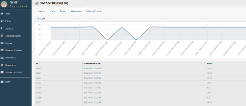
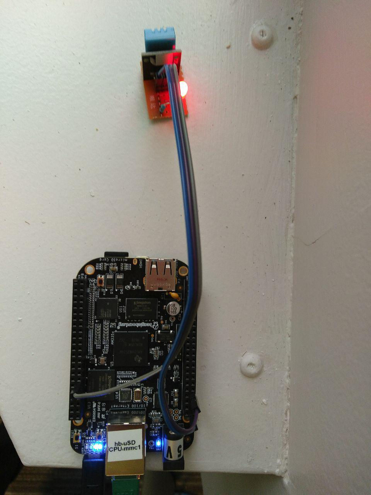

# Demonstrator of using Balena for deployment and logging data to a Gost instance

## Technologies demonstrated
1. **[Balena OS](https://www.balena.io/os/)**
  - **What it is:** Open source linux based operating system build framework (based on yacto), built for managing IoT devices (large numbers of low power networked computers) and the applications running on them that uses docker containers, git and Open Balenda for deployment. [GitHub](https://github.com/balena-os/meta-balena)
  - **How it's used here:** A instance of Balena OS is deployed on a BeagleBone Black SBC running the application monitor [src](monitor/) which is deployed via a this dockerfile [src](Dockerfile).

2. **[Open Balena](https://www.balena.io/open/docs/getting-started/)**
  - Open source ecosystem (deployable via docker compose) that provides the API, git repos, and cross compile build tools to deploy Balena OS devices and applications.  [Github](https://github.com/balena-io/open-balena)
  - **How it's used here:**  The commercial version includes a sophisticated web based GUI for interacting with deployed devices, this demo uses the open source instance with cml interface only deployed in a hosted Ubuntu virtual machines.  

3. **[OGC Sensor Things](https://www.opengeospatial.org/standards/sensorthings)**
  - _Open Geospatial Consortium Sensor Things API is "...an open and unified framework to interconnect IoT sensing devices, data, and applications over the Web. It is an open standard addressing the syntactic interoperability and semantic interoperability of the Internet of Things"_[1].  Or in other words it provides a standardized and standards based mechanism for capturing sensor observations built on existing standards and ontologies. [Github](https://www.opengeospatial.org/standards/sensorthings)
  - Amongst other standards Sensor Things uses the [OGC Observations and Measurements](https://www.opengeospatial.org/standards/om) model and OGC Ontology for Sensors, Observations, Samples, and Actuators [SOSA](https://www.w3.org/ns/sosa/).  Combined they create a model for capturing sensor data that provides the framework for making that data linked.
  -   **How it's used here:** This demo uses Gost (see below) which is an implimentation of Sensor Things.

4. **[Gost](https://www.gostserver.xyz/)**
  - Gost is a GoLang implementation of Sensor Things that includes a web based GUI front end for exploring sensors and their data [Github](https://github.com/gost/sensorthings-net-sdk)
  - As a Sensor Thing implementation the result is a web portal displaying semantically linked sensors, their metadata, and their observations.  
  -  **How it's used here:** This repo contains the source for deploying a DHT11 sensor connected to a BeagleBoneBlack via Balena OS and Open Balena cloud.  The monitor application running on the BeagleBone 

## Demo
* [Gost Portal Demo](http://129.74.246.19:8080/#/home)
  - Temperature Datastream Observations. [Live stream](http://129.74.246.19:8080/#/datastream/106)

  - Humidity Datastream Observations. [Live stream](http://129.74.246.19:8080/#/datastream/107)

## Hardware
1. Platform BeagleBone Black
2. DHT11 Temperature and Humidity Sensor

[1] https://www.gostserver.xyz/
